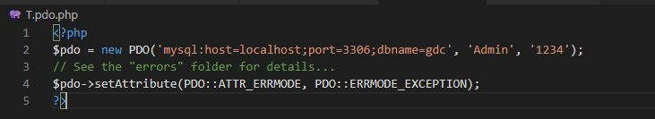

# GDC Gestionnaire de Don Certifié

Cette application est encore en phase de prototype : 

Nous souhaitons, par ce projet, aider les associations humanitaires à se développer correctement. Pour cela nous souhaitons résoudre un problème en particulier lié à la réception des dons pour les associations d’aide humanitaire par des particuliers par le biais du numérique. 
Nous savons qu’il existe actuellement des requêtes de dons numériques capables de récolter les dons à travers des moyens de payement en ligne. En conséquence, l’objectif sera d’améliorer les services de dons en ligne en créant nous mêmes une nouvelle plateforme numérique capable de répondre aux besoins des associations d’aide humanitaire. 


***Vidéo de présentation du projet***

[](https://www.youtube.com/watch?v=J5qV5SJTtuc&ab_channel=VincentBernet)

---

## Table of Contents 

- [Installation](#installation)
- [Fonctionnalités](#features)
- [Equipe](#team)
- [Contact](#Contact)

---

## Installation Local Optionnel (déjà en ligne)

Premièrement vous avez besoin d'une plateforme de serveur local comme MAMP ou XAMP <br /><br />
1] Telecharger le dossier complet dans votre dossier "htodcs" du serveur local <br />
2] Aller sur votre page PHPmyAdmins et créer une nouvelle database nommée GDC <br />
(Vous pouvez copié coller le script Sql suivant : CREATE DATABASE GDC DEFAULT CHARACTER SET utf8 ;) <br />
3] Go in Sql interface of this DataBase and copy paste the following Sql querrys : <br />

 ```
--
-- Table structure for table `don`
--

CREATE TABLE `don` (
  `Don_id` int(11) NOT NULL,
  `user_id` int(11) NOT NULL,
  `Association` text,
  `NumCarte` int(255) DEFAULT NULL,
  `DateExpi` int(255) DEFAULT NULL,
  `Crypto` int(255) DEFAULT NULL,
  `Titulaire` varchar(255) DEFAULT NULL,
  `Montant` int(255) DEFAULT NULL,
  `Date_Don` datetime DEFAULT CURRENT_TIMESTAMP
) ENGINE=InnoDB DEFAULT CHARSET=utf8;

-- --------------------------------------------------------

--
-- Table structure for tale `users`
--

CREATE TABLE `users` (
  `user_id` int(11) NOT NULL,
  `FirstName` varchar(128) DEFAULT NULL,
  `LastName` varchar(255) DEFAULT NULL,
  `Email` varchar(128) DEFAULT NULL,
  `Password` varchar(128) DEFAULT NULL,
  `PhoneNumber` int(255) DEFAULT NULL
) ENGINE=InnoDB DEFAULT CHARSET=utf8;

--
-- Indexes for dumped tables
--

--
-- Indexes for table `don`
--
ALTER TABLE `don`
  ADD PRIMARY KEY (`Don_id`),
  ADD KEY `user_id` (`user_id`);

--
-- Indexes for table `users`
--
ALTER TABLE `users`
  ADD PRIMARY KEY (`user_id`),
  ADD KEY `email` (`Email`),
  ADD KEY `email_2` (`Email`),
  ADD KEY `password` (`Password`);

--
-- AUTO_INCREMENT for dumped tables
--

--
-- AUTO_INCREMENT for table `don`
--
ALTER TABLE `don`
  MODIFY `Don_id` int(11) NOT NULL AUTO_INCREMENT;

--
-- AUTO_INCREMENT for table `users`
--
ALTER TABLE `users`
  MODIFY `user_id` int(11) NOT NULL AUTO_INCREMENT;

--
-- Constraints for dumped tables
--

--
-- Constraints for table `don`
--
ALTER TABLE `don`
  ADD CONSTRAINT `don_ibfk_1` FOREIGN KEY (`user_id`) REFERENCES `users` (`user_id`) ON DELETE CASCADE ON UPDATE CASCADE;
COMMIT;
```

4] Only if you are on Mac : Go to pdo.php file and change the port number to 8808 <br/>

&nbsp;&nbsp;&nbsp; 

5] Run the index.php file on your browser, if no SQL error's statement pop everything work !
If there is some error check your database and your port number.

## Features
On this application i implemetended multiples featurs such as 
 - Login/Register/Logout possibility linked to our DataBase
 - Complete CRUD application
 - Posibility to read/edit/delete only the profile created your own userprofile. 
 - Data validation all over our forms (via php and some java alert), using Session to set flash message
 - All forms use Session to avoid reloading thepage and get anoying pops up and ressending data to our database with only Post.
 - Night mode button using Java script to change css of our whole website, using changment of CSS on the DOM and saving those on localstorage
 - Html and CSS injections protection via Html entities and using pdo to make the link beetween our page and our DataBase


---
## Team

> Whole application was made by me when i was getting a coursera specialisation on web developpment :

 <a href="https://github.com/VincentBernet.com" target="_blank">**Software Engineering Student**</a> |
|:---:|
| [](https://github.com/VincentBernet.com)    |
| <a target="_blank" rel="noopener noreferrer" href="https://github.com/VincentBernet">`github.com/BernetProductions`</a> |


---

## Contact
- Don't hesitate to contact me on Github or on Linkedin, i'm currently seeking an intership around Paris for April 2021 :

[](https://www.linkedin.com/in/vincent-bernet-028a64193/)


---

## License

[](http://badges.mit-license.org)

- **[MIT license](http://opensource.org/licenses/mit-license.php)**
- Copyright 2021 © <a href="https://www.linkedin.com/in/vincent-bernet-028a64193/" target="_blank">Bernet  Vincent</a>.
